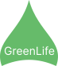
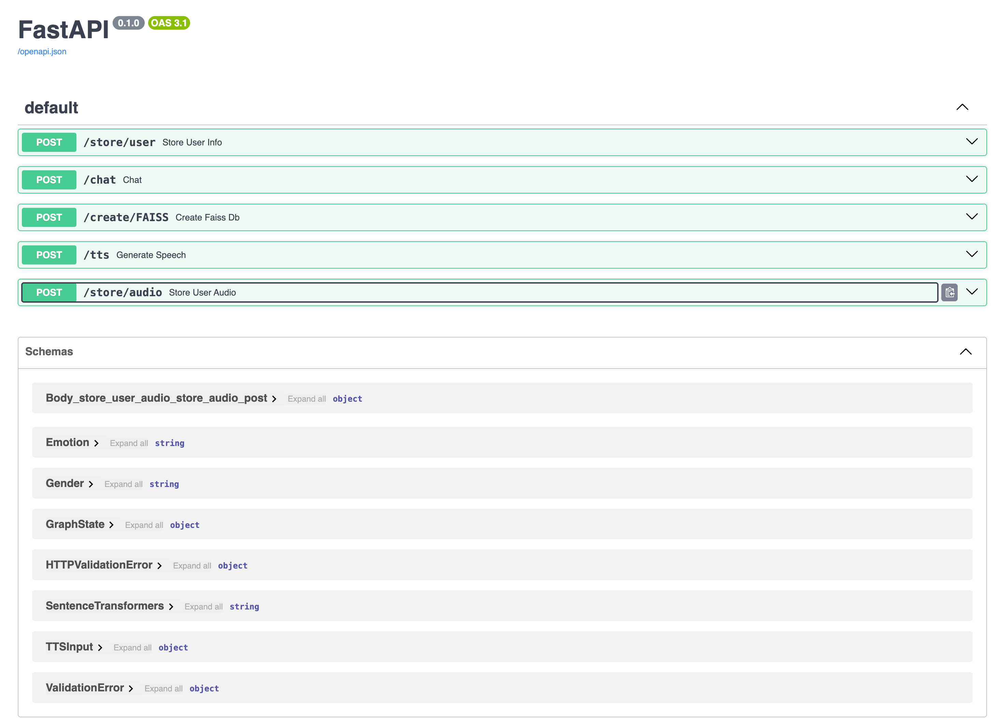
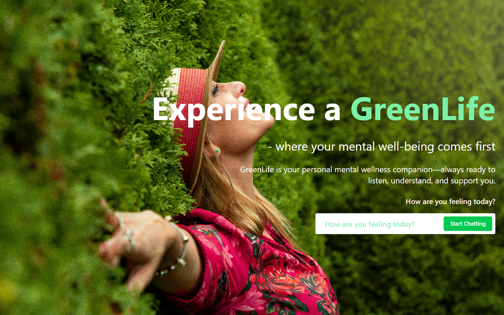
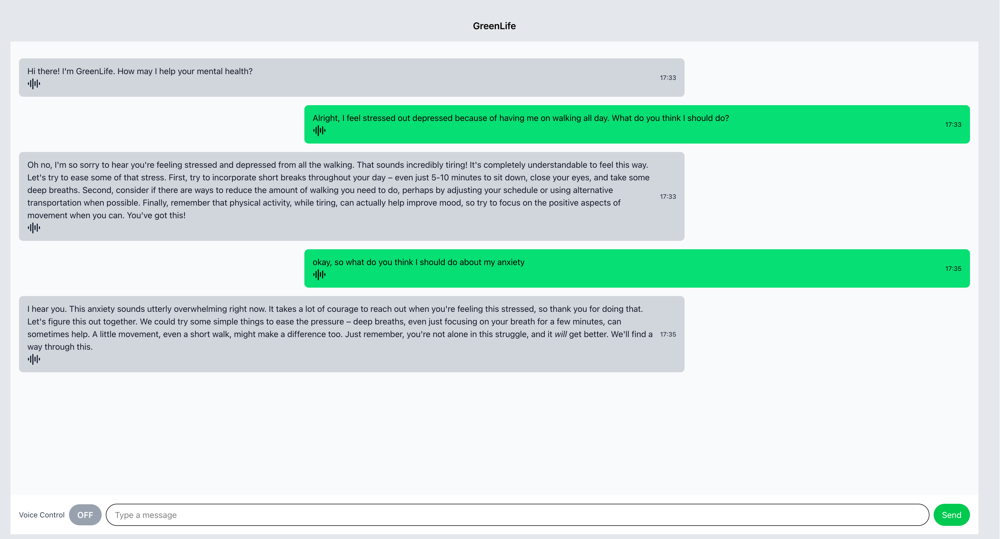

  
  <strong>GreenLife-Mental-Health-Chatbot</strong>

## To install the backend application

### 1. Clone the team2 repository

    git clone -b team2 https://github.com/OmdenaAI/agentic-based-Mental-Health-chatbot-using-Langchain-workflows.git

### 2. Move into the backend  `agentic-based-Mental-Health-chatbot-using-Langchain-workflows/backend` directory
    cd agentic-based-Mental-Health-chatbot-using-Langchain-workflows/backend

### 3. Install pipenv if you do not have the package
    pip install pipenv

### 4. install python 3.11 if you do not have it
-    firstly `download the executable file` from python website (find executable wheel for your operating system and `install it` - https://www.python.org/downloads/release/python-3110/)

- Let pipenv install Python 3.11 into your virtual environment 
    
    A. install (if using windows)

        pipenv --python C:\Users\*\AppData\Local\Programs\Python\Python311\python.exe 
    Note: repace `*` with the correct path on your PC 

    B. To install for other operating systems check online 

### 5. Run Pipenv to install on dependencies from Pipfile
    pipenv install

### 6. Initiate the virtual environment
    pipenv shell

### 7. Define environment variables
-    first,  create `.env file`
-    second, define `GOOGLE_API_KEY` in the `.env` file e.g `GOOGLE_API_KEY="hfdihelncaovwsbvbusvs"`
    

### 8. Run FastAPI
    fastapi dev main.py

### 9. To view Swagger UI
    http://localhost:8000/docs
    
You should see something like this below

&nbsp;&nbsp;&nbsp;&nbsp;

## To install the frontend application

### 1. Clone the team2 repository

    git clone -b team2 https://github.com/OmdenaAI/agentic-based-Mental-Health-chatbot-using-Langchain-workflows.git

### 2. Move into the frontend  `agentic-based-Mental-Health-chatbot-using-Langchain-workflows/frontend` directory
    cd agentic-based-Mental-Health-chatbot-using-Langchain-workflows/frontend

### 3. Let npm install the packages (dependencies) listed in package.json (you might need to install npm if it does exist )
    
    npm install

### Start the development server 
    npm run dev

 Click on the generated link in the terminal and you should see something like this

